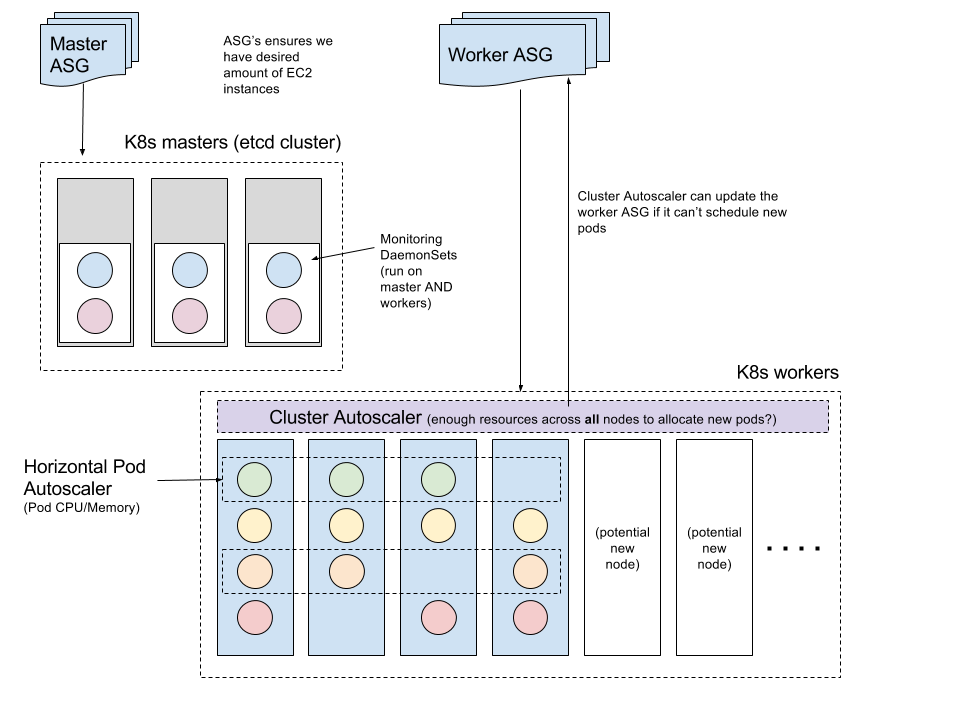

# Kubernetes autoscaling

 
 
 There are 3 main components that scale Kubernetes:
 
 1. AWS autoscaling groups for a) master and b) worker EC2 instances
   -  there may be additional ASG's if using multiple AZ's to run k8s masters.
 2. Application-specific horizonal pod autoscalers (HPA's)
 3. K8s AWS cluster autoscaler

The diagram above shows the domain of each scaling component. 

### AWS autoscaling groups (ASGs)

During Kubernetes installation, the [kops](https://github.com/kubernetes/kops) installer creates at least 2 [ASGs](http://docs.aws.amazon.com/autoscaling/latest/userguide/AutoScalingGroup.html): masters and nodes. If masters are spread across > 1 AWS availability zone, then there will be an ASG for each master per AZ. These ASGs specify a min, max, and desired amount of instances. Out of the box, Kubernetes won't automatically change these values, we'd have to use Terraform, awscli or the AWS console to make changes. 

### HPAs

[Horizontal pod autoscalers](https://kubernetes.io/docs/user-guide/horizontal-pod-autoscaling/) periodically check CPU utilization and update a [replication controller | deployment | replica set] to increase/decrease pods across all available nodes in the cluster to a specified min/max. An HPA will **not** add or remove EC2 instances. In order for an HPA to work, a [replication controller | deployment | replica set] MUST specify resource requests (and preferrably limits).

See the following specs for setting resource requests/limits:

- https://kubernetes.io/docs/api-reference/v1/definitions/#_v1_podspec
- https://kubernetes.io/docs/api-reference/v1/definitions/#_v1_container
- https://kubernetes.io/docs/api-reference/v1/definitions/#_v1_resourcerequirements

### K8s AWS Cluster Autoscaler

The [AWS Cluster Autoscaler](https://github.com/kubernetes/contrib/blob/master/cluster-autoscaler/cloudprovider/aws/README.md) periodically checks for containers that can't be scheduled based on resource requests for a deployment, and interacts with the node ASG to increase or decrease the number of nodes in a cluster. 

For example, if a deployment specifies a 500Mib memory request and there are no worker nodes available that can fulfill this request, the cluster autoscaler will update the node ASG to add an additional worker. When the new worker node has finished starting and joining the K8s cluster, pods will be scheduled to run on it. If the K8s scheduler determines that there are additional pods that cannot be scheduled, repeat up to a defined maximum number of worker nodes.

> The K8s AWS cluster autoscaler is *NOT* an AWS product, it's a set of pods that run in Kubernetes.
